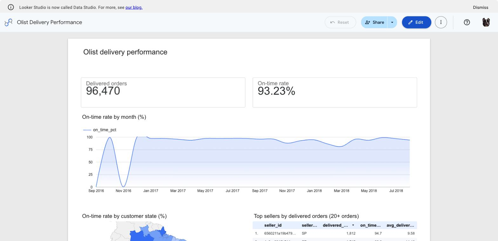
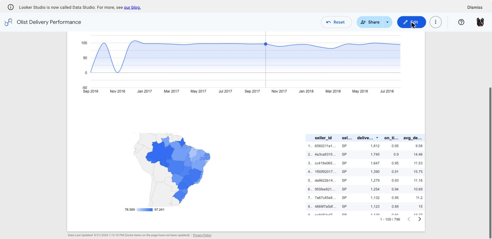

# Olist delivery performance on BigQuery

An ELT pipeline that loads a public e-commerce dataset into BigQuery, builds a
delivery-performance mart in SQL, gates it behind data quality assertions, and
measures what partitioning and clustering actually save.

Everything below is a real number produced by the scripts in this repo, not an
estimate.

```
Olist CSVs  ──01_load.sh──▶  olist_raw  ──02_marts.sql──▶  olist_marts
  (Kaggle)     bq load         (4 tables)   staging views      fct + dim
                                                 │
                                                 ├─03_quality_checks.sql──▶ 12 checks + ASSERT
                                                 │
                                                 ├─04_partition_cluster.sql─▶ _opt copy
                                                 │                             │
                                                 │   05_benchmark.sh ◀─────────┤
                                                 │   bytes before/after        │
                                                 │                             ▼
                                                 └─06_bi_views.sql ────────▶ 4 BI views
                                                                               │
                                                     07_bi_checks.sql ◀────────┤
                                                     16 checks + ASSERT        │
                                                                               ▼
                                                                       Looker Studio
```

## Run it

```bash
pipx install kaggle
./data/download.sh

gcloud config set project <your-project>
./01_load.sh

bq --location=US query --use_legacy_sql=false < sql/02_marts.sql
bq --location=US query --use_legacy_sql=false < sql/03_quality_checks.sql
bq --location=US query --use_legacy_sql=false < sql/04_partition_cluster.sql
./05_benchmark.sh

bq --location=US query --use_legacy_sql=false < sql/06_bi_views.sql
bq --location=US query --use_legacy_sql=false < sql/07_bi_checks.sql
```

`env.sh` holds the project, location and dataset names in one place, so a stray
`--location` can never send a job to the wrong region.

Every step is re-runnable: `01_load.sh` loads with `--replace`, the SQL files are
all `CREATE OR REPLACE`. Running the whole chain twice leaves exactly the same
data behind, which is the property that makes a pipeline safe to retry.

## What lands in the warehouse

| Layer | Object | Grain | Rows |
|---|---|---|---:|
| raw | `olist_raw.orders` | one order | 99,441 |
| raw | `olist_raw.order_items` | one item line | 112,650 |
| raw | `olist_raw.customers` | one customer | 99,441 |
| raw | `olist_raw.sellers` | one seller | 3,095 |
| marts | `olist_marts.fct_delivery_performance` | one **delivered** order | 96,470 |
| marts | `olist_marts.dim_seller` | one seller | 2,957 |

Headline figures from the fact table:

| Measure | Value |
|---|---|
| Delivered orders | 96,470 |
| Date range | 2016-09-15 → 2018-08-29 |
| On-time rate | **93.23 %** |
| Average delivery time | 12.5 days |
| Average slack against the promised date | 11.9 days early |

`is_late` compares the actual delivery date against the date promised to the
customer at checkout (`order_estimated_delivery_date`), so it measures a real
SLA rather than an invented one. Orders that never reached `delivered` are
excluded.

## The grain problem

An order can contain items from several sellers, so joining `orders` to
`order_items` naively turns one order into several rows and inflates every
revenue number. `02_marts.sql` handles it explicitly:

1. aggregate items to `(order_id, seller_id)`,
2. pick the seller holding the most items as the order's seller, breaking ties on
   `seller_id` so the result is identical on every run,
3. sum money per `order_id` separately, then join.

The fan-out is then checked, not assumed: `dim_order_count_mismatch` asserts that
orders summed across `dim_seller` equal the row count of the fact table.

## Data quality gate

`03_quality_checks.sql` runs 12 checks in four groups — structural, referential,
business-rule, reconciliation — prints a PASS/FAIL row for each, and ends with:

```sql
ASSERT (SELECT COALESCE(SUM(bad_rows), 0) FROM checks) = 0
  AS 'data quality checks failed — read the result table above ...';
```

`ASSERT` makes the job exit non-zero, so this is a gate a CI run can hang off,
not a table someone has to remember to read. Current state: **12 / 12 PASS**.

## The BI layer

`06_bi_views.sql` builds four views, one per thing the dashboard shows:

| View | Grain | Feeds |
|---|---|---|
| `vw_bi_orders` | one delivered order | drill-down detail, date and state filters |
| `vw_bi_monthly` | one month | the on-time trend line |
| `vw_bi_by_state` | one customer state | the freight and delay map |
| `vw_bi_seller_leaderboard` | one seller, 20+ orders | the seller table |
| `vw_bi_calendar` | one day | date dimension for Power BI |
| `ref_br_state` | one state | full names and regions, so a map geocodes without guessing |

The dashboard points at these rather than at the fact table, so that metric
definitions live in SQL under review instead of inside a calculated field in one
person's report. Booleans are exposed as `on_time_flag` (0/1), which makes
on-time rate a plain `AVG()` in any tool. The 20-order floor on the leaderboard
is a judgement call — a seller with three orders and a perfect record is noise —
and it is written down here rather than buried in a dashboard filter.

The dashboard contains **no calculated fields** — `on_time_pct` is exposed on a
0-100 scale straight from SQL, because Looker Studio's percent format appends a
`%` without scaling and would render a 0-1 rate as "0.93%". Keeping the scaled
column in the view means every number on screen traces back to this file.

`07_bi_checks.sql` gates that layer with 16 assertions: the `_opt` copy holds the
same rows and the same headline rate as its source, every aggregate view adds
back up to the fact row count, `month_start` round-trips to `order_month`, the
region codes are valid ISO 3166-2, no plotted rate escapes 0–1, and the
leaderboard floor actually holds, and `on_time_pct` stays exactly 100x
`on_time_rate`, in every view that exposes both. The model's joins are checked too: every order maps to a state name and region, the reference holds all 27 states, and the calendar covers every order date with no gaps. Current state: **16 / 16 PASS**.

## The dashboard

Built in Looker Studio (which Google now presents as **Data Studio**) on the
BigQuery connector, reading the views above.




Five components, each bound to a view rather than to a query typed into the
report:

| Component | Shows | Source |
|---|---|---|
| Scorecard | on-time rate, **93.23 %** | `vw_bi_orders.on_time_pct`, averaged |
| Scorecard | delivered orders, **96,470** | `vw_bi_monthly.orders`, summed |
| Time series | on-time rate by month | `vw_bi_monthly` |
| Geo chart | on-time rate by customer state | `vw_bi_orders.customer_region_code` |
| Table | seller leaderboard, 796 sellers | `vw_bi_seller_leaderboard` |

Laid out on a two-column grid: title, the two scorecards side by side, the trend
across the full width, then the map and the table sharing the bottom row. The
trend's y-axis is pinned to 0-100 rather than left on auto, which otherwise
padded the scale out to -50..150 and squashed the line into the middle third.
Every percentage on the page reads on the same 0-100 scale, including the
leaderboard column, because `on_time_pct` is exposed by each view that has a
rate — not because a number was reformatted in the report.

Two things the dashboard confirms rather than asserts: both scorecards match the
figures `03_quality_checks.sql` verifies against the warehouse, and the table
footer reads `1 - 100 / 796`, which is exactly the number of sellers clearing the
20-order floor written into the view.

Two readings worth having, both checked against the warehouse rather than eyeballed
off the chart:

The violent swing at the left of the trend line is **not** a delivery collapse.
`vw_bi_monthly` shows 2016-09 holding a single order that happened to be late
(0 %), 2016-10 holding 265 orders at 99.25 %, and **2016-11 missing from the data
entirely** — the chart draws that absent month as zero. 2016-12 is another single
order. The first month with enough volume to mean anything is 2017-01, at 750
orders and 97.07 %. A reader who trusts the left edge of this chart is reading
sampling noise and a gap in the source data as a trend.

The geography is real, though. On-time rate by customer state runs from **78.59 %
in Alagoas (397 orders) to 97.24 % in Amazonas (145 orders)**, so the national
93.23 % averages over an 18-point spread.

The report is private. Opening it to the public is a sharing change, not a code
change, and the screenshots above are what the repo carries.

## Continuous integration

`.github/workflows/ci.yml` runs two gates on every push and pull request:

- `shellcheck` over the three shell scripts,
- `sqlfluff parse` over `sql/`, which checks every file against the BigQuery
  dialect — `ASSERT`, `RANGE_BUCKET` and multi-statement scripts included.

Neither gate needs cloud credentials, which is why they can run on a public
repo without a service account key sitting in a secret. The data quality gate is
deliberately *not* in CI: it asserts against live BigQuery tables, so it runs
where the data is. `03_quality_checks.sql` already exits non-zero on failure, so
wiring it into a scheduled job is a credential problem, not a code one.

## Partitioning and clustering, measured

`05_benchmark.sh` runs three queries against both table layouts. The query text
is byte-for-byte identical; only the table name changes. It reports two numbers:
the **dry-run** bytes (what the planner commits to — partition pruning only) and
the **real** bytes from `INFORMATION_SCHEMA.JOBS` (partition *and* cluster
pruning). Real runs pass `--nouse_cache`, since a cached result reports 0 bytes.

| Query | Layout | dry-run bytes | real bytes | reduction |
|---|---|---:|---:|---:|
| Q1  3-month range, all states | plain table | 1,929,400 | 1,929,400 | |
| | partition + cluster | 412,540 | 412,540 | **78.6 %** |
| Q2  one state, full history | plain table | 2,701,160 | 2,701,160 | |
| | partition + cluster | 2,701,160 | 2,701,104 | **0.0 %** |
| Q3  6-month range + one state | plain table | 5,209,380 | 5,209,380 | |
| | partition + cluster | 2,174,580 | 2,174,580 | **58.3 %** |

Reading the table honestly:

- **Q1 and Q3 improve because they filter the partition key.** Partitioning only
  pays when the query restricts the column the table is partitioned on.
- **Q2 gains nothing.** It filters `seller_state`, a cluster column, and
  clustering saved 56 bytes out of 2.7 MB. That is not a broken configuration —
  the fact table is **15.18 MB**. Block pruning needs a table large enough to
  have blocks worth skipping; below roughly a gigabyte there is nothing to skip.
  Clustering is the right choice for this schema at production scale and a no-op
  at this one, and the measurement says so instead of the README claiming a win.
- Slot time rises slightly on the partitioned table for these small queries —
  more partitions means more metadata work, which the byte savings do not offset
  until the data is much bigger.

## Why the partition key is `order_month`, not `order_date`

The first version used `PARTITION BY order_date`, which is the correct key. It
produced an **empty table**.

The BigQuery sandbox forces a 60-day partition expiration on time-unit
partitioned tables (`defaultPartitionExpirationMs = 5184000000`), and
`OPTIONS(partition_expiration_days = NULL)` is silently overridden. Olist runs
from 2016 to 2018, so every partition was already expired at the moment it was
written and all 96,470 rows were dropped on creation — quietly, with the job
reporting success.

Integer `RANGE` partitioning is not covered by that policy. `order_month`
(`YYYYMM` as `INT64`) is built in `02_marts.sql`, checked against `order_date` by
`order_month_mismatch` in `03_quality_checks.sql`, and used as the range key in
`04_partition_cluster.sql`. On a billed project the date version is the better
key and the file documents it as such.

One related BigQuery behaviour worth knowing: `CREATE OR REPLACE` refuses to
change an existing table's partitioning spec, so `04_partition_cluster.sql` drops
the derived table first to stay re-runnable.

## Known limits

- The data covers 2016–2018 and is Brazilian; the pipeline shape transfers, the
  numbers do not.
- Sandbox tables expire after 60 days. Re-running the chain rebuilds everything
  from the CSVs, which is why the load step is scripted rather than manual.
- The trend chart plots a missing month (2016-11) as zero and gives single-order
  months the same visual weight as months with thousands. A production version
  would suppress months below a volume floor, the way the seller leaderboard
  already does.
- No orchestrator yet — the steps are run in order by hand. Airflow is the next
  piece.
- The `_opt` table is a full copy of the fact table, which doubles storage. At
  15 MB that is irrelevant; at production scale you would partition the fact
  table itself rather than keep two.

## Files

| File | What it does |
|---|---|
| `env.sh` | project, location, dataset names, and a `bqq` query helper |
| `data/download.sh` | fetch the Olist CSVs from Kaggle |
| `01_load.sh` | preflight, create dataset, load 4 tables, print row counts |
| `sql/02_marts.sql` | staging views, `fct_delivery_performance`, `dim_seller` |
| `sql/03_quality_checks.sql` | 12 checks + `ASSERT` gate |
| `sql/04_partition_cluster.sql` | partitioned + clustered copy of the fact |
| `05_benchmark.sh` | bytes scanned before/after, dry-run and real |
| `sql/06_bi_views.sql` | the four views a BI tool reads |
| `sql/07_bi_checks.sql` | 16 checks + `ASSERT` over the `_opt` copy and the views |
| `results/benchmark.md` | generated output of the benchmark |
| `dashboard/screenshots/` | the Looker Studio report, captured |
| `powerbi/` | Power BI build guide, DAX measures, theme |
| `.github/workflows/ci.yml` | shellcheck + sqlfluff gates, no credentials needed |
| `.sqlfluff` | pins the BigQuery dialect so local and CI runs agree |

## Data

[Brazilian E-Commerce Public Dataset by Olist](https://www.kaggle.com/datasets/olistbr/brazilian-ecommerce),
published on Kaggle under CC BY-NC-SA 4.0. The CSVs are not redistributed here —
`data/download.sh` fetches them, and `.gitignore` keeps them out of the repo.
